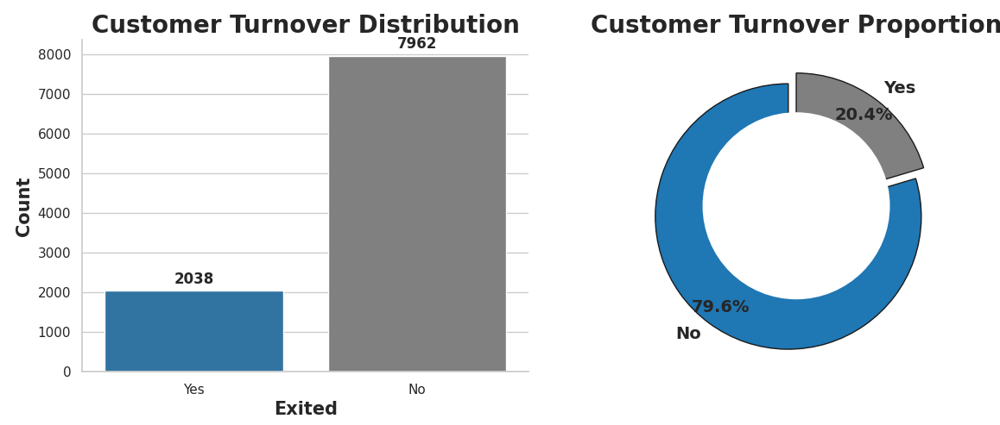

# 
BANK TURNOVER ANALYSIS

## What is Customer Churn 🤔?
**Click on the video to watch📺**

## Overview:

This project focuses on analyzing bank turnover to identify key factors contributing to customer churn in the banking sector. By leveraging data-driven insights, we aim to propose strategies to improve customer retention and enhance service delivery.

## Objectives

- **Understand Customer Behavior**: Analyze historical data to understand why customers leave the bank.
- **Predictive Modeling**: Develop models to predict potential churn to enable proactive retention strategies.
- **Actionable Insights**: Provide actionable recommendations based on the analysis to reduce turnover rates.

## Dataset:
 [Bank Customer Churn](https://www.kaggle.com/datasets/radheshyamkollipara/bank-customer-churn/data)

## Data Description

The dataset used in this analysis contains the following key attributes:

1.   RowNumber
2.   CustomerId
3.   Surname
4.   CreditScore
5.   Geography and more

## Implementation:

**Libraries:** sklearn, Matplotlib, pandas, seaborn, and NumPy

## Few glimpses of EDA:
### 1. Customer Turnover Distribution
>
>The dataset shows a significant difference between the number of customers who have left the bank ("Yes") and those who have stayed ("No").

### 2. Customer Turnover Distribution

# More project details on EDA & Results:
**Click here:**
[Bank Turnover Analysis](https://colab.research.google.com/drive/1T8MYyxysA7KzMLcFFeGgJyYvb5Yci3bA#scrollTo=lkCi_np54J5R)

# 
Enjoy 👍

