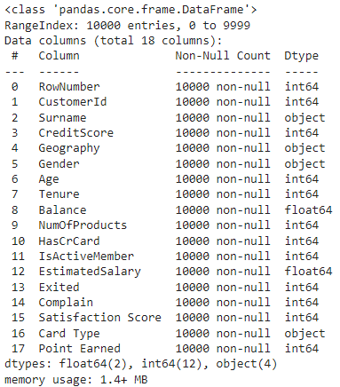
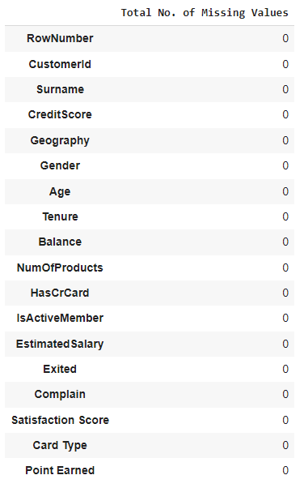
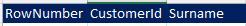
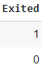
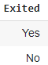

# <div align="center">BANK TURNOVER ANALYSIS</div>


## What is Customer Churn 🤔?
**Click on the video to watch📺**

[](https://www.youtube.com/watch?v=InOB1wXEkC8)

## Project Overview:

This project focuses on analyzing bank turnover to identify key factors contributing to customer churn in the banking sector. By leveraging data-driven insights, we aim to propose strategies to improve customer retention and enhance service delivery.

## Objectives:

- **Understand Customer Behavior**: Analyze historical data to understand why customers leave the bank.
- **Predictive Modeling**: Develop models to predict potential churn to enable proactive retention strategies.
- **Actionable Insights**: Provide actionable recommendations based on the analysis to reduce turnover rates.

## Dataset 📖:
 The source of the data is from [Bank Customer Churn](https://www.kaggle.com/datasets/radheshyamkollipara/bank-customer-churn/data)

## Data Description:

The dataset used in this analysis contains the following key attributes:

- RowNumber : Identification for each row.
- CustomerId, Surname: Identifiers and names, generally not useful for prediction.
- CreditScore, Geography, Gender, Age: Demographic information.
- Tenure, Balance, NumOfProducts, HasCrCard, IsActiveMember, EstimatedSalary: Financial and account-related details.
- Exited: This is the target variable indicating whether a customer has churned (1) or not (0).
- Complain, Satisfaction Score, Card Type, Point Earned: Additional customer satisfaction and engagement metrics.

## Implementation:

**Libraries:** sklearn, Matplotlib, pandas, seaborn, and NumPy

## Data Cleaning

### 1. Checking Data Information
>
>
>**Insight:**
>
>The dataset contains 10,000 records across 18 columns, which include 15 numerical and 3 categorical columns.

### 2. Checking the Total Number of Missing Values
>
>
>
>**Insight:**
>
>As indicated by the table, there are no missing values; therefore, data imputation is not necessary.

### 3. Checking for Duplicate Values
>
>**Insight:**
>
>There is 0 duplicate row in the dataset

### 4. Dropping Irrelevant Columns
>
>
>**Insight:**
>
>We dropping ["RowNumber","CustomerId","Surname"] as they did not give significant contribution to the analysis

### 5. Renaming Values in Exited Column
>  to  
>
>**Insight:**
>
>For this report, since we need to check and compare other variables with the Exited column, we decided to change the Exited column from binary values (0, 1) to (No, Yes) to enhance visibility during the analysis. Additionally, we will retain the four columns with binary numbers as we believe they will be beneficial for later statistical analysis.


## Exploratory Data Analysis 📊:

### 1. Displaying Customer Turnover Distribution
>
>The dataset shows a significant difference between the number of customers who have left the bank ("Yes") and those who have stayed ("No").

### 2. Displaying Customer Turnover by Gender
>
>**Insight:**
>
>According to the Gender bar graph above, female customer leading the percentage of turnover (11.4%) from the bank compared to male(9.0%).
>
>**Recommendation:**
>
>1. **Customer Research:** Conduct surveys, focus groups, and interviews with female customers to understand their specific concerns, preferences, and needs. This >research can reveal insights into why they may be more likely to turn from bank.
>
>2. **Monitoring and Feedback:** Regularly monitor the effectiveness of these strategies through ongoing feedback mechanisms and adjust them as necessary to ensure they >continue to meet the needs of female customers effectively

### 3. Displaying Customer Turnover by Number of Product
>
>**Note:**
>
>Banks offer a wide range of products and services to meet the financial needs of their customers, ranging from basic banking services to more complex financial >solutions. For example here's a list of products from Maybank (https://www.maybank.com/en/products-and-services.page):
>
>1. Wealth Management
>2. Insurance & Takaful 
>3. Consume and Digital Solutions
>4. Etc..
>
>**Insight:**
>
>The majority of customers hold either one or two products, while fewer customers have more than two products.
>The highest turnover occurs among customers with only one product.
>
>**Recommendation:**
>
>1. **Customer Research:** Conduct surveys, focus groups, and interviews with female customers to understand their specific concerns, preferences, and needs. This >research can reveal insights into why they may be more likely to turn from bank.
>
>2. **Monitoring and Feedback:** Regularly monitor the effectiveness of these strategies through ongoing feedback mechanisms and adjust them as necessary to ensure they >continue to meet the needs of female customers effectively.

### 4. Displaying Customer Turnover Based on Active Status (Active vs. Non-Active)
>
>**Insight:**
>
>1. IsActiveMember: Indicates active membership status (1 = Active, 0 = Inactive).
>2. Active members show a significantly lower turnover rate compared to inactive members, highlighting the importance of engagement in customer retention strategies.
>
>**Recommendation:**
>
>It is a loss if a bank loses its customer. Below are the few suggestions that can keep customer running away from a bank:

>1. **Loyalty Programs:** Implementing loyalty programs that reward customers for their business can increase retention. Rewards could be in the form of better rates, >lower fees, or even non-banking perks.
>2. **Community Engagement:** Banks that actively engage with their community, such as sponsoring local events or supporting local businesses, can build goodwill and >strong local customer base.

### 5. Displaying Customer Turnover by Satisfaction Score
>
> **Note:**
>
>The visualization for "Customer Turnover by Satisfaction Score" shows the distribution and impact of satisfaction scores on customer churn. The percentages >indicate how each satisfaction score segment contributes to the overall customer churn and retention with score 5 is the perfect score and 1 is the lowest score.

>**Insights:**
>
>Satisfaction score of 2 appear to have higher churn rates, suggesting that less satisfied customers are more likely to leave. This relationship can guide >strategies to improve customer retention by focusing on enhancing satisfaction levels.

### 6. Visualizing Customer Turnover by Balance.
>
>**Insights:**
>
>Over 3,000 customers have a zero account balance. These customers are more likely to deactivate their accounts. When excluding zero values, the balance >distribution approximates a normal distribution.
>
>**Recommendations:**
>
>1. For customers with low or zero balances, strategies to engage them might be developed to prevent account dormancy and potentially convert them into more active, >profitable customers.
>
>2. Analyzing the needs of different segments might reveal opportunities for new financial products or services, especially targeted at high-balance customers who >show a higher propensity to turnover.

### 7. Visualizing Customer Turnover by Age.
>
>**Insights:**
>
>1. Customers who exited are typically older than those who stayed. The distribution for those who exited is skewed towards older ages, while the distribution for >those who stayed is more concentrated in the younger age range.
>
>2. Notably, the peak for customers who exited (Yes) is much higher around ages 45 to 60, suggesting this age group is at higher risk of churning.
>
>3. The median age of customers who exited is higher than those who stayed. This is evident from the position of the median line in each box.
>
>4. Customers who stayed have a narrower interquartile range (IQR), mostly concentrated between the ages of 30 and 40. In contrast, the age range for those who >exited is broader, with a lower quartile near 40 and an upper quartile extending to around 55.

### 8. Correlation Matrix
>
>
>**Insight:**
>
>The correlation matrix above highlights several important relationships:

>1. **Age**: Shows a moderate positive correlation with Exited, suggesting that older customers are more likely to exit.
>   
>2. **IsActiveMember**: Has a negative correlation with Exited, confirming that active members are less likely to leave.
>   
>3. **Balance**: Has a small positive correlation, indicating a slight tendency for customers with higher balances to exit, which might be counterintuitive and >warrants further investigation.
>   
>4. **NumOfProducts**: Interestingly, there's a negative correlation here; customers with more products are slightly less likely to exit, which might suggest that >diversified services could help in retention.

## Machine Learning 🦾:

### 1. Encoding Categorical Columns and Splitting the Dataset
``` Python
# Encoding categorical columns
label_encoder = LabelEncoder()
categorical_cols = ['Geography', 'Gender', 'Card Type']
for col in categorical_cols:
    df[col] = label_encoder.fit_transform(df[col])

# Splitting the dataset into training and testing sets
X = df.drop('Exited', axis=1)
y = df['Exited']
X_train, X_test, y_train, y_test = train_test_split(X, y, test_size=0.2, random_state=42, stratify=y)

# Checking the shapes of the splits
X_train.shape, X_test.shape, y_train.shape, y_test.shape
```
>**Insight:**
>
>1. **Encoding Categorical Variables:** Convert categorical variables like Geography, Gender, and Card Type into a format that can be used by machine learning >algorithms.
>   
>2. **Data Splitting:** Split the dataset into a training set and a testing set. By splitting the data, we ensure that we're not just making a model that's good on >paper but one that will actually work well when it's used in real applications.
>   
>**The training set includes 8,000 samples, and the testing set includes 2,000 samples, with 14 features in each.**

### 2. Model Creation using Logistic Regression
``` Python
# Training Logistic Regression Model
logistic_model = LogisticRegression(max_iter=1000, random_state=42)
logistic_model.fit(X_train, y_train)

# Predicting on the test set
y_pred_logistic = logistic_model.predict(X_test)

# Evaluating the model
accuracy_logistic = accuracy_score(y_test, y_pred_logistic)
print("Accuracy Score of Model on Test Data is =>", round(accuracy_logistic * 100, 2), "%")

report_logistic = classification_report(y_test, y_pred_logistic, output_dict=True)

print("F1 Score of the Model is =>", f1_score(y_test, y_pred_logistic))
print("Recall Score of the Model is =>", recall_score(y_test, y_pred_logistic))
print("Precision Score of the Model is =>", precision_score(y_test, y_pred_logistic))
```
>Logistic Regression is a type of statistical analysis used to predict the outcome of a variable that can be one of two types; 0 (no chance)
>& 1 (certain to >happen)
>
>**Result:**
>
>**Accuracy Score** of Model on Test Data is => 79.2 %
>
>**F1 Score** of the Model is => 0.0956521739130435
>
>**Recall Score** of the Model is => 0.05392156862745098
>
>**Precision Score** of the Model is => 0.4230769230769231
>
>**Insight:**
>
>The Logistic Regression model achieved an accuracy of 79.2% on the test set. However, a closer look at the precision, recall, and F1-score reveals some important >details:
>
>1. **Precision Score** for class 1 (exited) is relatively low at 42%, indicating that the model isn't very good at identifying exited customers accurately.
>   
>2. **Recall** for class 1 is very low at 5%, meaning the model fails to identify a significant portion of the actual exited customers.
>   
>3. **F1-score** for class 1 is also quite low at 10%, which combines precision and recall, indicating poor performance on the minority class.
>   
>Logistic Regression seems to not be a best model for this data. Below is the Implication and Suggestions:
>
>1. **Class Imbalance:** One common reason for such results is class imbalance. Non-exited customer is more than exited customer. The model might be biased towards predicting the majority class (non-exited). It's worth checking the class distribution and considering techniques like SMOTE, adjusting class weights, or resampling to address imbalance.
>   
>2. **Model and Variables Reassessment:** The current variables might not be strong indicators of the outcome, or logistic regression may not be the best model for this data. We will consider exploring other models like Random Forests or Gradient Boosting Machines (GBMs), which we will learn in near future.


### 3. Importance Variables in the Model Prediction
``` Python
importance = logistic_model.coef_[0]

# Matching the Variables importance with the column names of the training data
features = X_train.columns
importance_df = pd.DataFrame({'Variable Name': features, 'Importance': importance})

# Since we want to visualize the absolute values of the importance
importance_df['Importance'] = np.abs(importance_df['Importance'])

# Sort the Variables by importance
importance_df = importance_df.sort_values(by='Importance', ascending=False)

# Visualizing the Importance Variables
plt.figure(figsize=(12,7))
sns.barplot(x="Importance", y="Variable Name", data=importance_df, palette="plasma")
plt.title("Importance Variables in the Model Prediction", fontweight="black", size=20, pad=20)
plt.yticks(size=12)
plt.show()
```
>
>The key factors that significantly influence the deactivation of customers banking facilities are:- Age, Complain, Credit Score and IsActiveMember

## Conclusion:
>**Key-Points:**
>1. **Model Performance:** The logistic regression model provided a reasonable baseline performance with turnover customers, which is evident from the low recall and F1 score for the positive class.
>   
>2. **Feature Importance:** The feature importance analysis from the logistic regression model can provide insights into which factors are most influential in predicting customer turnover. Important features may include customer age, account balance, number of products, credit score, and activity level. Understanding these can help inform strategies to retain customers.
>
>3. **Business Insights:** Active membership appears to be a strong indicator of retention, suggesting that efforts to engage customers could reduce turnover. Older >customers were more likely to turnover, highlighting a potential area to explore tailored retention strategies. The presence of a credit card did not show a >strong correlation with turnover, suggesting that simply having a credit card isn't a deciding factor in customer retention.
>   
>**Strategic Recommendations:**
>
>1. Investigate the reasons behind the turnover of older customers and consider offering products or services that might be more appealing to them.
> 
>2. Enhance customer engagement and satisfaction, perhaps by improving customer service or offering loyalty programs, as active members are less likely to turnover.
> 
>3. Consider a more detailed analysis of the customers with high balances who exited to understand if there are specific services or products that are not meeting
>   their needs.
>   

*Side Note:*
*The goal of this analysis is not only to predict turnover but also to understand its drivers so that targeted actions can be taken to reduce it. With these insights, a business can develop focused retention strategies to maintain a healthier customer base.*

## If you are interested to look on more details on each Coding, EDA & Results
## Click here: [Bank Turnover Analysis](https://colab.research.google.com/drive/1T8MYyxysA7KzMLcFFeGgJyYvb5Yci3bA#scrollTo=lkCi_np54J5R)

# <div align="center">Enjoy 👍</div>
